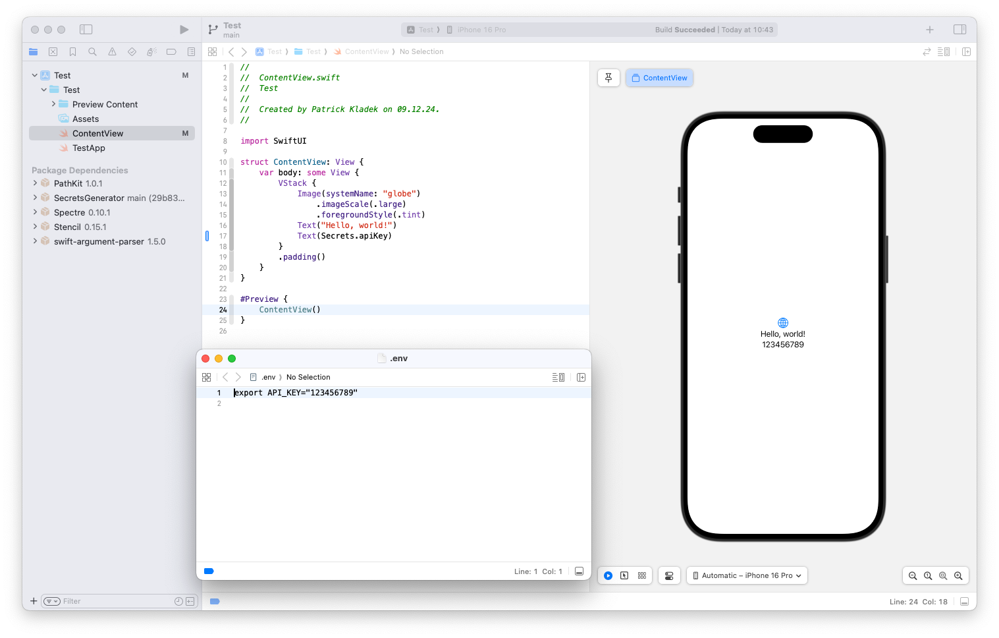

# SecretsGenerator

Allows you to use variables defined in a .env file in swift in a secure way. Heavily inspired by [Pouch](https://github.com/sunshinejr/Pouch) and [NSHipster article regarding secret management](https://nshipster.com/secrets/).

## Setup

1) Add this package to your project
2) Create a `.env` file in the root of your project
3) add `.env` to gitignore
4) Reference the variables in Swift code via: `Secrets.yourEnvKey`

## Notes about security

While this is for sure an improvement to your normal, plain-text based flow, this doesn't guarantee that your keys won't be reverse-engineered. If you want to learn more about secret management and it's security, I recomend you to read the whole article I linked at the top of the Readme: [NSHipster article regarding secret management](https://nshipster.com/secrets/).